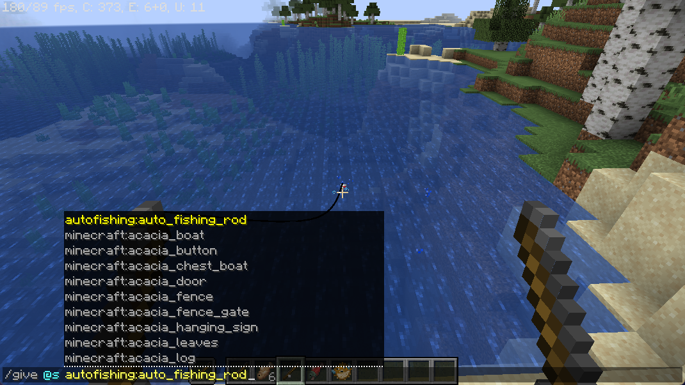

# AutoFishing
MinecraftMod(1.20.4) - Automatically fishes
## How to use
Place the Auto fish rod in your main hand and the fish rod in your off hand.
Then right click to start fishing.

> tip: A small and interesting mod I wrote for personal learning.